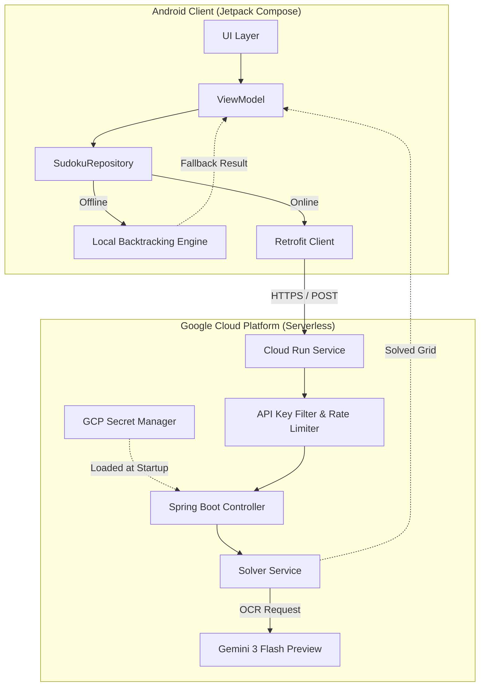

# AI Sudoku Solver
### Native Android OCR Utility with Spring Boot Microservices

A production-grade mobile application that allows users to seamlessly solve Sudoku puzzles using a native Android app backed by a secure Spring Boot microservice. This project demonstrates modern Android development (Jetpack Compose, CameraX) combined with Cloud-Native DevOps practices (Docker, Cloud Run, Secret Manager).

## Table of Contents
- [Architecture Overview](#architecture-overview)
- [Features](#features)
- [Security & DevOps](#security--devops)
- [Project Setup](#project-setup)
- [Deployment (Google Cloud Run)](#deployment-google-cloud-run)
- [License](#license)

## Architecture Overview
This project implements a Hybrid Intelligence architecture. It prioritizes Cloud AI for perception (OCR) but maintains a robust offline fallback for logic (solving), ensuring 100% availability.



The system is split into two primary components:

- **Android Client (`/android`)**: A native Kotlin application built with Jetpack Compose and Material You. It handles image capture, UI state, and local validation.
- **Server Backend (`/server`)**: A Spring Boot microservice containerized with Jib. It handles the AI integration (Gemini), Rate Limiting, and serves as the secure gateway.

## Features
- **Jetpack Compose UI**: Modern, declarative UI with Material You dynamic theming that adapts to the user's wallpaper.
- **AI Grid Extraction**: Integrates with the Gemini 3 Flash Preview API to visually recognize and extract Sudoku grids from camera photos in milliseconds.
- **Offline-First Architecture**: Features a local Backtracking + MRV Heuristic engine. If the cloud is unreachable, the app automatically switches to local solving without user interruption.
- **Smart Validation**: Real-time conflict detection (highlighting duplicates in rows/cols) before the user even hits "Solve."

## Security & DevOps
This project moves beyond basic app development by implementing Enterprise-grade security and DevOps patterns:

- **Zero Trust Secrets**: API keys are never hardcoded. The backend dynamically fetches the `GEMINI_API_KEY` from GCP Secret Manager at runtime using the Principle of Least Privilege.
- **Resilience & Throttling**: An in-memory Token Bucket Rate Limiter protects the API from abuse/DDoS, ensuring the free tier quota is never exceeded.
- **Containerization**: The backend is built into an optimized Docker image using Google Jib (distroless), removing the need for a Dockerfile and reducing the attack surface.
- **Serverless Autoscaling**: Deployed to Google Cloud Run, allowing the backend to scale to zero (costing $0.00) when idle and automatically spinning up during traffic spikes.

## Project Setup

### Prerequisites
- Java JDK 25+ (for Backend) / Java JDK 21 (for Android)
- Android Studio Ladybug+
- A Google Cloud Platform Project (for Secret Manager).

### Backend (Spring Boot) Setup
1. Navigate to `server/` and open in IntelliJ IDEA.
2. Set up your local environment variables in `application-dev.yml` or via your IDE run configuration.
3. Run: `mvn spring-boot:run`

**GCP Secret Manager (Production Profile):**
To run with the `prod` profile, your environment must have access to GCP.
1. Create secrets in GCP Secret Manager: `gemini-api-key` and `mobile-api-key`.
2. Ensure your Service Account has the role `roles/secretmanager.secretAccessor`.

### Android App Setup
1. Open `android/` in Android Studio.
2. Create a `local.properties` file in the root `android/` folder (ignored by Git):

```properties
# Your Backend API Key (matches the server's expected key)
MOBILE_API_KEY=your_secure_random_key_here
# Backend URL (Localhost for emulator or your Cloud Run URL)
BACKEND_URL=http://10.0.2.2:8080/
```
3. Sync Gradle and run on an Emulator (Pixel 6+ recommended).

## Deployment (Google Cloud Run)
The backend is designed for a single-command deploy flow:

1. **Configure GCP:**
```bash
export GOOGLE_CLOUD_PROJECT="your-project-id"
```

2. **Build & Push Container:**
```bash
mvn compile jib:build -Dimage=gcr.io/$GOOGLE_CLOUD_PROJECT/sudokusolver
```

3. **Deploy Service:**
```bash
gcloud run deploy sudokusolver \
  --image gcr.io/$GOOGLE_CLOUD_PROJECT/sudokusolver \
  --platform managed \
  --allow-unauthenticated \
  --region asia-south1
```

## Tests
To ensure the algorithmic integrity of the application, unit tests are provided for both the Spring Boot backend and the Android client.

### Backend Tests (Spring Boot)
The tests are located in `server/src/test/java/.../SudokuSolverServiceTest.java` and can be run using `mvn test`.
They cover:
- `testSolveValidGrid`: Verifies that the MRV backtracking algorithm successfully solves a standard 9x9 grid and replaces all empty spaces.
- `testSolveUnsolvableGrid`: Ensures that an `IllegalArgumentException` is thrown when an unsolvable grid (e.g., with inherent constraint violations like two 5s in the same row) is submitted.

### Frontend Tests (Android)
The tests are located in `android/app/src/test/java/.../domain/LocalSudokuSolverTest.kt` and can be run via Android Studio or `./gradlew testDebugUnitTest`.
They cover:
- `testIsValid_validGrid_returnsTrue`: Verifies the structural validation logic correctly accepts a valid grid.
- `testIsValid_invalidGridWithDuplicateInRow_returnsFalse`: Ensures grid validation properly catches row/column/box rule violations.
- `testSolve_validGrid_returnsSolvedGrid`: Validates the offline fallback solving algorithm correctly solves a puzzle locally.
- `testSolve_invalidGrid_throwsException`: Ensures that submitting an invalid grid to the local solver correctly throws an exception.

## License
[MIT License](LICENSE)
